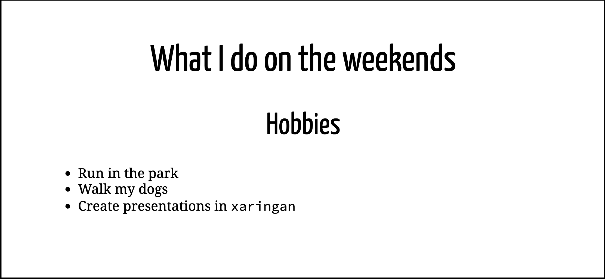
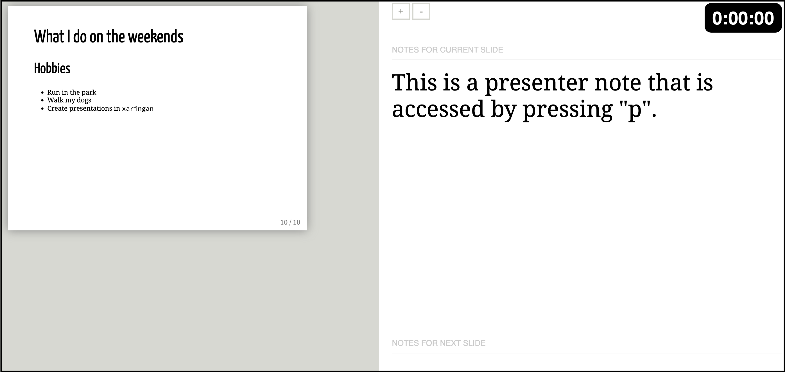
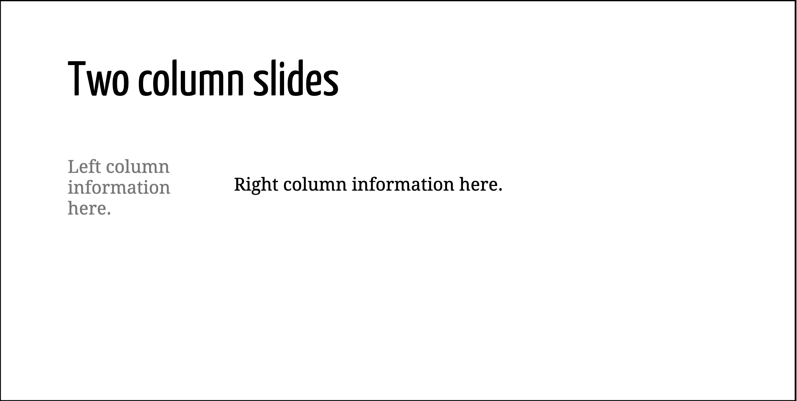
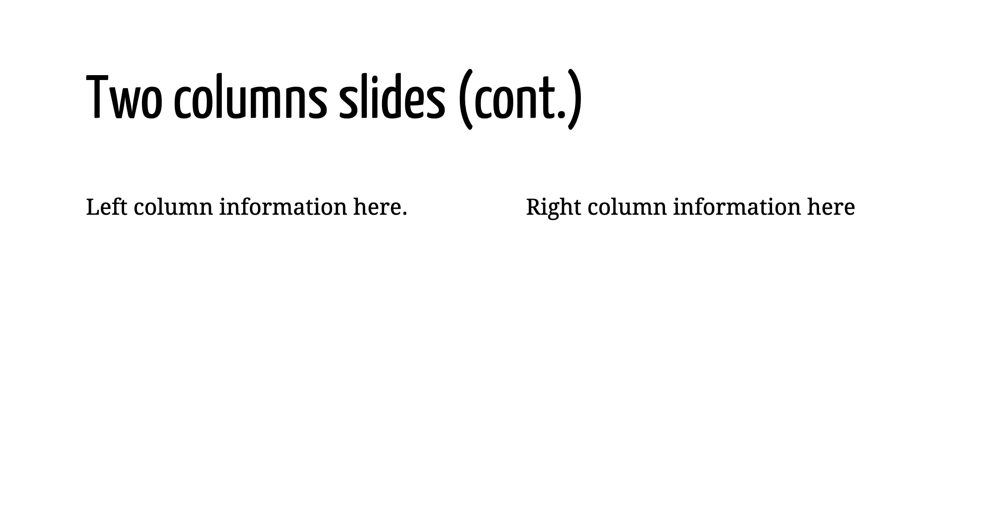
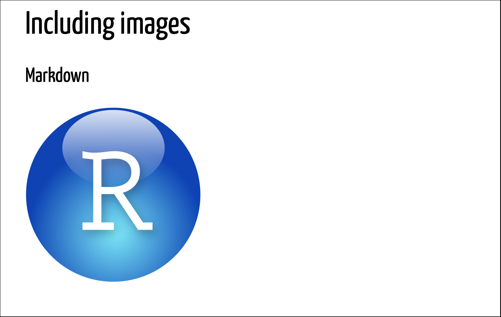
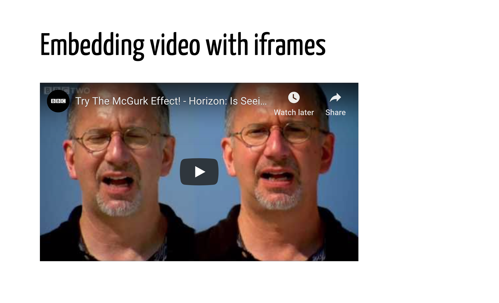
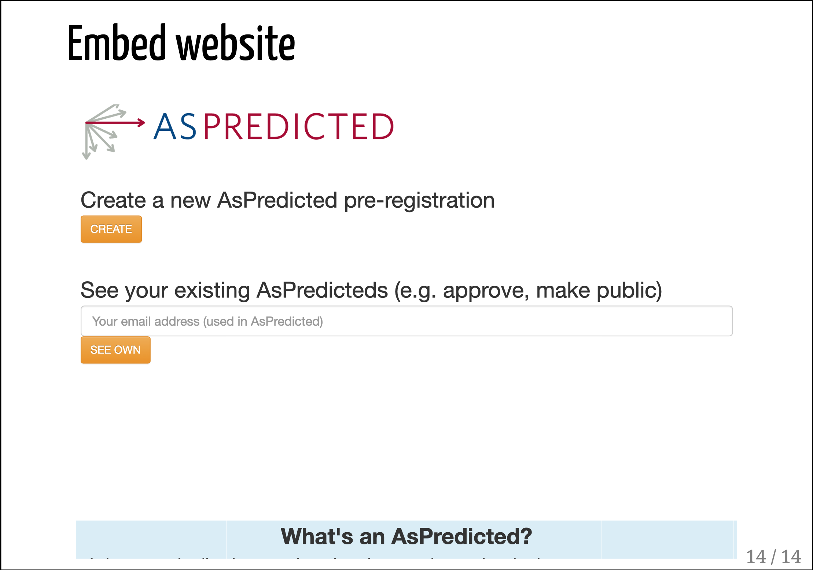
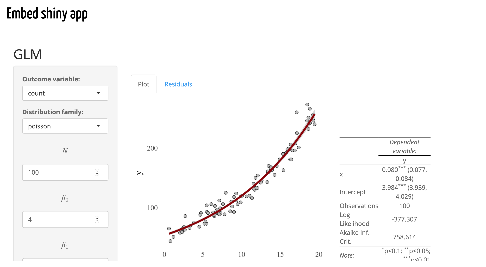

# Basics {#basics}

In this chapter you will get up and moving with your first HTML presentation 
using `xaringan`.
Specifically, we will cover the basics regarding getting started and 
generating your HTML slides, as well as talk about some markdown and 
`xaringan`-specific syntax considerations. 
Next, you will learn how to incorporate some light customization to give 
your slides a more personal touch. 
This chapter concludes with some examples of best practices for including R 
code in your `xaringan` presentations.


## Getting started

Before we get started you must install the `xaringan` package if you have not 
already done so. 
You can install `xaringan` via CRAN by typing `install.packages("xaringan")` 
into the console. 
If you use the RStudio IDE, you can install `xaringan` by clicking the 
packages tab and searching for `xaringan`. 
If you prefer to be on the cutting edge of software development you can 
install the latest version of `xaringan` directly from github by typing 
`devtools::install_github("yihui/xaringan")` into the console, but note that 
this method requires that you have `devtools` installed first. 

Once you have installed `xaringan` you are ready to get started. 
We will begin with the simplified template that is provided in the `xaringan` 
package. 
This will allow you to learn the basics of `xaringan` quickly and provide you 
with easy access to an example that you can refer back to if necessary. 
You can create a new copy of the template using the menu in the RStudio IDE. 
Click "File" → "New File" → "R Markdown" → "From Template" → "Ninja 
Presentation".^[If you are not using RStudio, that's fine too. 
HTML presentations generated using `xaringan` are just standard R Markdown 
(.Rmd) files, so you can create one from scratch using your text editor of 
choice and follow the examples all the same.] 
Once you click "OK" a new .Rmd file will automatically open in RStudio. 

### Front matter

As touched upon above, `xaringan` slides are generated from R Markdown files. 
This means that your presentation will have YAML front matter, like any other 
.Rmd file.^[You can learn the basics of R Markdown here: 
https://rmarkdown.rstudio.com/lesson-1.html]
Below is the front matter of our template. 
If you are not using the RStudio IDE, feel free to copy the front matter and 
paste it into your .Rmd document. 

```{r, 'front-matter-template', eval=F}
---
title: "Presentation Ninja"
subtitle: "⚔<br/>with xaringan"
author: "Yihui Xie"
date: "2016/12/12 (updated: `r Sys.Date()`)"
output:
  xaringan::moon_reader:
    lib_dir: libs
    nature:
      highlightStyle: github
      highlightLines: true
      countIncrementalSlides: false
---
```

Here you can include all of the importnat information you would typically 
include in the title slide of your presentation. 
The main difference between HTML slides generated in `xaringan` and any other 
R Markdown file is that the HTML output is generated using the output 
format `moon_reader`. 
The output format serves as a wrapper for remark.js, which is doing all of the 
heavy lifting under the hood. 
This information may not seem too important to most people, but it is worth 
mentioning because the `moon_reader` format is the only part of the front 
matter that is truly necessary to create your slides. 
In fact, if you were feeling adventurous you could create slides that *only* 
contained this information, i.e., `output: xaringan::moon_reader`, and delete 
all the other information. 
We will come back to remark.js in chapter 6, Advanced Topics. 
Now you are ready to generate your first HTML slides using `xaringan`. 

### Generating your slides

There are several methods for generating and working with slides in a 
`xaringan` presentation, which we will now cover. 
First things first, save your .Rmd file to a location on your hard drive and 
give your presentation file a name. 
If you are using RStudio, simply click the `Knit` button at the top of the 
application window and you will be prompted to save the .Rmd file. 
RStudio will render the slides after you save and they will automatically 
appear in the Viewer window. 
**Pro tip**: you can install the `infinite_moon_reader` RStudio Addin which 
will allow you to update your slides in real time (more on this in Chapter 6). 
If you are not using RStudio, save your .Rmd file and then you can generate 
your slides from the console by typing 
`rmarkdown::render("your-file-name.Rmd")`.

### Exploring a `xaringan` presentation

Before we go into the details of customizing your slides, let's explore the 
`xaringan` presentaion we just created. 
If you are using RStudio the presentation should have opened automatically in 
the Viewer panel. 
If you rendered your slides manually, double click the HTML file that was 
produced to open it in your web browser of choice.^[Note: if you are creating 
your slides manually, your presentation will not have much content yet. 
You can explore the same example slides here: 
https://slides.yihui.name/xaringan/] 
You should see something like this: 


Use the left and right arrow keys to navigate the slides. 
There are a whole host of features at your finger tips, but we will only 
highlight two for now. 
You can type the number of a given slide and press the "enter"/"return" key to 
navigate to that slide, i.e., "9" + "return". 
If you press the "p" key you will enter "Presenter mode". 
Cool, right? 
You can press the "p" key again to leave presenter mode. 
Type the "h" key to see a list of some of the other features. 
As mentioned, we will talk more about these in Chapter 6. 
In the next section we will cover the basics for editing your `xaringan` 
presentation.


## Editing your slides 

Editing a `xaringan` presentation is quite simple. 
If you are already familiar with Markdown syntax, you will be a `xaringan` 
ninja with little effort. 
If you are new to Markdown syntax you can cover the basics at 
https://rmarkdown.rstudio.com/lesson-8.html. 
For now, let's start with a clean slate and delete everything in our template 
**after** the YAML front matter. 
That is, delete everything in your file **after** line 13. 

### General syntax

`xaringan` shares all of the basic features of Markdown syntax. 
This means you can create **bold** text and *italics* by surrounding text with 
double or single stars, i.e., \*\*bold\*\* and \*italics\*, respectively. 
You can also create unordered lists: 

- this 
- is 
- and unordered list

and ordered lists: 

1. This is 1
2. This is 2
3. This is 3

like so: 

```{r, 'basics-markdown-example', eval=F}
You can also create unordered lists: 

- this 
- is 
- and unordered list

and ordered lists: 

1. This is 1
2. This is 2
3. This is 3
```

It is also possible to write complex mathematical formulas using LaTeX syntax 
via mathjax. 
You can write in-line math equations by surrounding your code with dollar 
signs, \$. 
For example, the formula to calculate standard scores is 
$z = \frac{X - \mu}{\sigma}$, which is written in LaTeX as 
`$z = \frac{X - \mu}{\sigma}$`. 
You can automatically center and increase the size of the formula by using 
double dollar signs, `$$`. 

$$y_{i} = \alpha + \beta x_{i} + \epsilon_{i}$$

We won't cover all of the details of Markdown syntax here, but rather highlight 
some of the `xaringan`-specific features.

### Creating individual slides

In `xaringan` you use a sequence of three hyphens, `---`, to separate 
slides.^[Note that this is slightly different from ioSlides where hastags, 
\#\#, are used to dilineate where a new slide begins.] 
You are not required to include any headers, but you can using standard 
Markdown syntax, i.e., hashtags. 
Thus, we could create a simple slide including a header, a subsection, and a 
list by including the following code after the YAML front matter:^[This implies 
that the final three hyphens of the YAML front matter indicate the end of the 
title slide and the beginning of slide \#2.]

```{r, basics-slide-example, eval=F}
# What I do on the weekends

## Hobbies

- Run in the park
- Walk my dogs
- Create presentations in `xaringan`
```

Feel free to copy this into your file and click "Knit". 
The output should render like this: 


### Alignment

We can control the alignment of the content in the slide in a manner of ways. 
In this subsection we will focus on customing vertical and horizontal alignment 
by 1) assigning a class to an entire slide, or 2) using html content classes to 
align specific elements. 

To change the alignment of the entire slide we set some `class` paramenters at 
the top of the slide. For vertical alignment we can use "top" (default), 
"middle" or "bottom". For horizontal alignment we can use "left" (default), 
"center" or "right". For example, to align the content of the previous slide 
in the middle-center of the slide we would adjust the markdown as follow: 

```{r, basics-alignment-example-1, eval=F}
class: center, middle

# What I do on the weekends

## Hobbies

Run in the park  
Walk my dogs  
Create presentations in `xaringan`
```


Note: I removed the unordered list because they look rather odd when the 
content is centered horizontally. Also, notice that there are two (2) spaces 
after each line, which is how linebreaks are interepreted in Markdown syntax. 

The second method we can use to align content is by using content classes. 
If you are experienced using HTML/CSS this will be nothing new. 
If not, for our purposes, you can think of a content class as a simplified 
method for specifying how HTML elements are displayed. 
In order to do this we precede the CSS specification with a period and then 
wrap the content using brackets. 
This is a common technique for customizing in `xaringan` (more below). 
For example, in order to align a specific element to the center we would use 
`.center[]`. 
Here I will update the previous example by only centering the slide section and 
the subsection headers. 

```{r, basics-alignment-example-2, eval=F}
.center[
# What I do on the weekends

## Hobbies
]

- Run in the park 
- Walk my dogs 
- Create presentations in `xaringan`
```




### Incremental slides

It is often useful in a presentation to incrementally show information. 
This is easily done in `xaringan` using two hyphens, `--`. 
Careful, don't confuse this with the three hyphen slide breaks! 
You can incrementally reveal pretty much any type of inforamtion you put into 
a slide. 
Let's add some examples to our presentation by creating a new slide. 
Don't forget, to create the new slide we need to add `---`. 
In our case, this would be after the last line of list we created in the 
previous example. 
For the sake of completeness I will include the code from both slides below. 

```{r, basics-incremental-slides, eval=F}
# What I do on the weekends

## Hobbies

- Run in the park
- Walk my dogs
- Create presentations in `xaringan`

---

# Incremental slides

### Sentence example

This sentence
--
is displayed 
--
incrementally. 
```

If you copy this example and Knit your slides you will notice notice that the 
sentence is rendered incrementally on a single line even though it is written 
in on separate lines. 
This is because the double hyphen, `--`, has to be on its own line with no 
spaces before or after in order to work properly. 
We can also use this technique to reveal items of a list incrementally: 

```{r, basics-incremental-list, eval=F}
# Incremental slides

### Non-incremental sentence example

This sentence is no longer displayed incrementally. 

### Incremental list example

- An incremental list
--

- Is useful
--

- Sometimes
```

### Notes and comments

We often need to include notes in our slides and comments in our code. 
In `xaringan` you can create comments using the standard comment format used 
in HTML: `<!-- content here -->`. 
You can put whatever you want between the two arrows and it will not be 
rendered in your slides. 
If you want to include notes in your slides you can do so by adding content 
after a series of three questions marks, `???`. 
The notes only become visible if you switch to presenter view by pressing "p" 
in the browser. 
Here we add a comment and some notes to out slides:

```{r, basics-comments-notes, eval=F}
# What I do on the weekends

## Hobbies

<!-- think of interesting hobbies to include here -->

- Run in the park 
- Walk my dogs 
- Create presentations in `xaringan`

???

This is a presenter note that is accessed by pressing "p".
```



### Multi-column slides

Another common feature of presentations is to display content in two columns. 
This is easibly acheived in `xaringan` using HTML content classes. 
Again, you will recognize the use of content classes because they begin with a 
period and and opening bracket, `.[`, and end with a closing bracket, `]`. 
You will learn more about these in chapter 3. 
Specifically, there are two options for creating two-column layouts. 
The first option is to use `.left-column[]` and `.right-column[]`. 
For example: 

```{r, basics-two-col-ex1, eval=F}
# Two column slides

.left-column[
Left column information here.
]

.right-column[
Right column information here.
]
```

would render like this: 



As you can see, this divides the left column into approxametely 1/3 of the 
slide width and the right column contains the remaining 2/3. 
This may be most useful when you need show a list on one side and need more 
space for content on the other. 
Another option is to divide the slide equally down the middle. 
You can achieve this by using `.pull-left[]` and `.pull-right[]`. 
For example: 

```{r, basics-two-col-ex2, eval=F}
# Two columns slides (cont.)

.pull-left[
Left column information here.
]

.pull-right[
Right column information here
]
```



## Making it yours

In this section you will learn how to further customize your `xaringan` slides 
by adding images and gifs; embedding video, webpages, and shiny apps; and 
using theme templates.

### Images and gifs

A great way to spice up your presentation is to include images, memes, and 
gifs. 
This can be accomplished in a number of ways in `xaringan`. 
We will cover three. 
The first and simplist method is to use Markdown syntax: ``. 
You put any information you want as the caption between brackets. 
The path to the image or a link to an online image goes between parenthesis. 
For example, the RStudio icon is hosted at the following web 
address: https://www.rstudio.com/wp-content/uploads/2014/06/RStudio-Ball.png. 
We can include this image in our presentation. 

```{r, basics-img-ex1, eval=F}
# Including images

### Markdown


```

The downside of this method is that you cannot currently control the size of 
the image that is rendered. 
If you are comfortable with HTML, you can include the image and control the 
width like so: 

```{r, basics-img-ex2, eval=F}
# Including images

### HTML


```

A third way to include an image in your presentation is to use a `knitr` code 
chunk and the function `include_graphics`, which is part of the `knitr` package. 

````
```{r, out.width = "300px"}`r ''`
knitr::include_graphics("https://www.rstudio.com/wp-content/uploads/
2014/06/RStudio-Ball.png")
```
````

And a final method is include the image as a background image by placing 
`background-image: url()` at the top of the slide with the relevant link. 
We can then control the size and position of the image by adding 
`background-size` and `background-position`: 

```{r, basics-include-image, eval=F}
background-image: url(https://www.rstudio.com/wp-content/uploads/
2014/06/RStudio-Ball.png)
background-size: 300px
background-position: 50% 50%
```

The `background-position` values refer to the respective horizontal and 
vertical positions. 
Regardless of the method you choose, the outcome should look something like 
this: 

{width=50%}

### Embedding video, webpages, and shiny apps

You can make your slides fun and interactive by embedding video or even a 
shiny app. 
This process is straightforward using an `iframe`. 
For example, we can include a youtube video demonstrating the McGurk Effect by 
embedding the url in an iframe as shown here: 

```{r basics-embedding-video, eval=F}
# Embedding video with iframes

<iframe width="560" height="315" 
src="https://www.youtube.com/embed/G-lN8vWm3m0"></iframe>
```

{width=50%}

If you need to show part of a website in your presentation you can use the 
same strategy. 
For example, here I will embed the homepage of aspredicted.org: 

```{r, basics-embed-website, eval=F}
# Embed website

<iframe src="https://www.aspredicted.org" style="border:none;" 
height="500" width="100%"></iframe>
```

{width=50%}

It is even possible to embed a shiny app in your slides for interactive 
demonstrations: 

```{r, basics-embed-shiny, eval=F}
# Embed shiny app

<iframe src="https://jvcasillas.shinyapps.io/shiny_glm/"></iframe>
```

{width=50%}


### Theme templates

You can easily change the way your slides look by changing the theme. 
There are many user contributed `xaringan` themes available. 
In the console run the following code to see a list of all of the themes 
currenlty available to you: `names(xaringan:::list_css())`

```{r, themes-list, echo=F}
names(xaringan:::list_css())
```

To change the your theme of your slides select one of the themes included in 
the list above and adjust the YAML front matter to include the css templates 
as shown here:   

```
---
output:
  xaringan::moon_reader:
    css: ["rutgers", "rutgers-fonts"]
---
```

Try out all of the themes until you find one that you like. 
If you can't find what you are looking for you can always create your own 
(more on this in Chapter 6)!

## Incorporating R code

Because your `xaringan` presentation uses the power of R Markdown you can 
analyse data and produce plots and tables as you normally would. In this 
section we will brielfy highlight a few `xaringan`-specific features related 
to knitr chunks and r code. 


- reuse knitr chunks, print plots later
- code highlighting (`*`, `{{}}`, and `#<<`; `highlight.output`)
- include code in presenter notes


## Summary

In this chapter you learned the basics of `xaringan`. 
This included the basics regarding getting started with your first 
presentation and implementing light customization to personalize your slides. 
You also learned some handy tricks related to using R code in your `xaringan` 
presentation. 
You are well on your way to becoming a presentation ninja. 
In the next chapter you will learn more about remark.js, the work engine 
under the hood of `xaringan`. 
